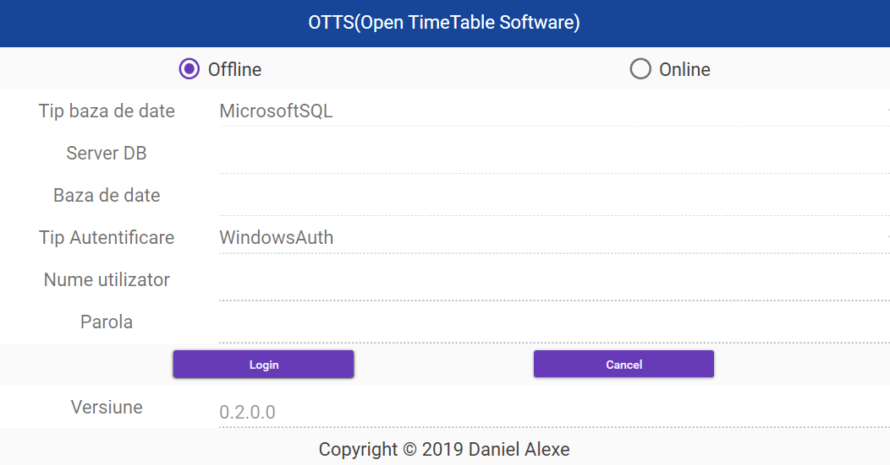
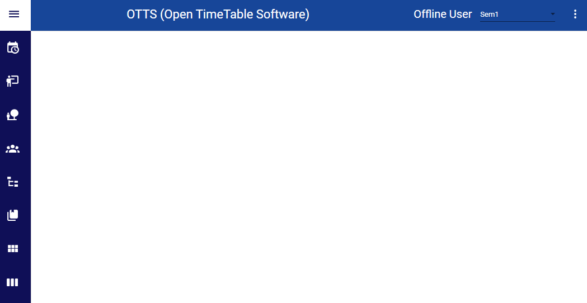
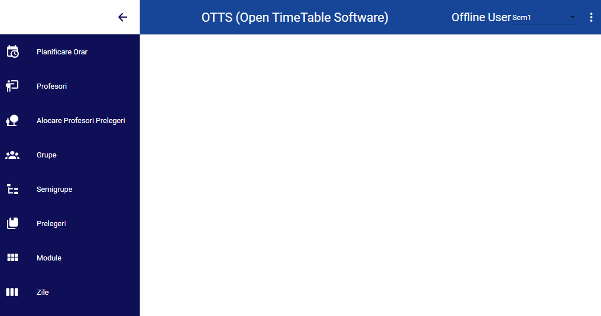
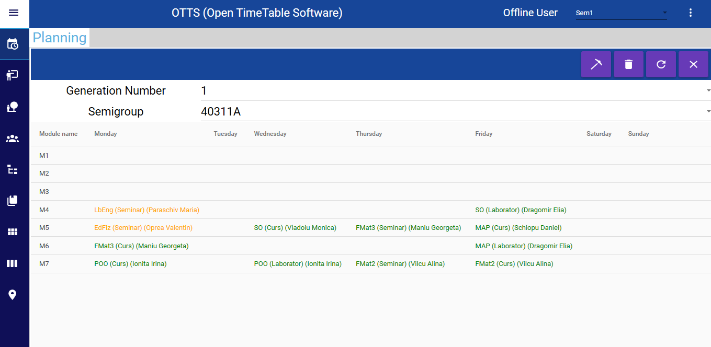
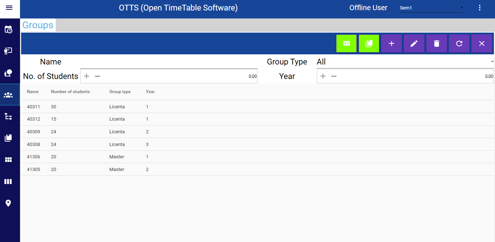
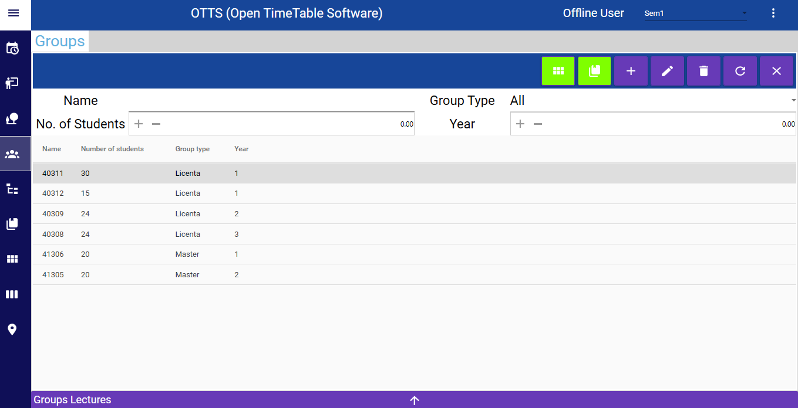
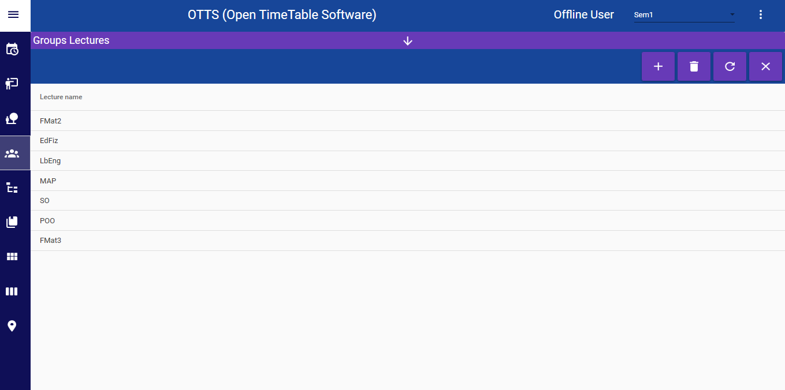

# OpenTimeTableSoftware
Free Time Table Application for Universities (Bologna process system).
## FAQ:
1. ***What is this?***  
This is an application designed to fulfill the need to generate the time table for a faculty, part of an University that adhered to the Bologna process.
2. ***Why did you do it?***  
The motivation that stands behind the application is that in all but a few cases the time table is made manually by the teachers and there are a lot of restrictions and personal preferences from the teachers that need to be taken into account. This way by having an application that can take into account all of this and generate multiple solutions of valid timetables the teachers in charge of the time table will do less administrative work.
3. ***What can the app do?***  
Currently the app has the following modules:
- Offline and Online use
- Two semesters system
- Lectures
  - Create and modify the lectures of your department.
- Modules
  - These are the time modules that your University has (Example: Module 1 from 12:00 to 14:00).
- Days
  - These are the available days where lectures can be scheduled for your groups.
- Halls
  - These are the halls that your department has access in order to host the lectures.
- Teachers
  - Here you can manage your teachers and allocate them a priority based on their hierarchy.
  - Also you can allocate prefered days,modules,halls for each teacher;
  - Finally you can allocate teachers to their lectures.
- Student Groups
  - These are the groups as their are defined in your University. Alongside these the application uses something called Semigroups as the unit for scheduling. A small Group has a single Semigroup, a big Group has multiple Semigroups. This is done in order to accomodate the capacities of the halls and also allow the teacher to focus on fewer students at a time.
  - Also you can allocate lectures to groups based on the curriculum;
  - Finally you can allocate modules to groups based on at what time do you want them to have lectures.
4. ***Who uses the app now?***  
Currently the app is in preliminary test by the TIMF department from the Universitiy of Petroleum and Gas, Romania.
## Screenshots:  
Login Screen
  
Main Menu  
  
  
TimeTable Planning  
  
Groups Menu
  
  
  
